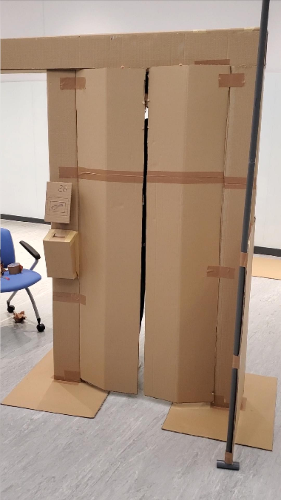
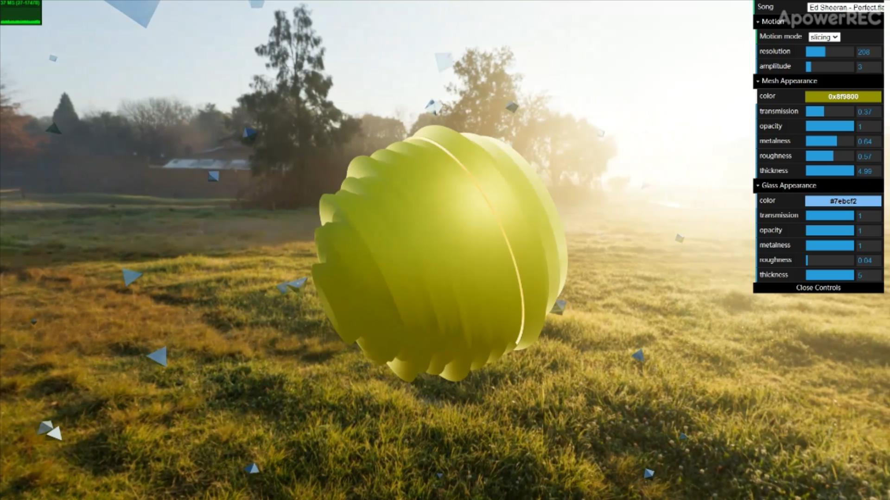

# 3D Music Visualizer
We implement uniform ways to deform any mesh in any resolution according to any acoustic signal, which is also the major challenge. 
The deformation scheme, resolution and sound signal can be changed during runtime seamlessly. We also properly design the whole scene by 
distribute plenty of shattered glass objects evenly and randomly around the mesh. All the material parameters can be adjusted during runtime 
according to the user's preference.

     

demo video: https://youtu.be/aYUXMY5IG1c

Group Members:

    - HUANG, Junkai (Abraham), jhuangce@connect.ust.hk
          sound analysis, material, rendering, GUI
    
    - YU, Mukai (Tom Notch), myual@connect.ust.hk
          mesh deformation and mapping to sound

How to use it
    
    - Need to have Internet connection because main.js imports libraries directly from https://threejs.org (so that we don't need to include the whole "three.js" folder)
    - Turn up the speaker/earphone, load the website and click on "GO"
    - Enjoy the music and the visualizer!
    - GUI :
        * Song : switch different Song
        * Motion mode : deformation scheme : slicing - vertical deformation , polar - spherical deformation
        * resolution : number of levels/segments that the mesh deforms
        * amplitude : the amount of deformation
        * Mesh Appearance : material parameters of the mesh at the center
        * Glass Appearance : material parameters of the shattered glass objects scattered around
        ** Feel free to switch different songs, play around with different deformation scheme and the material parameters!
